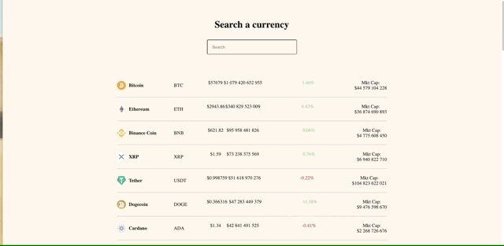

<h2>This project was bootstrapped with Create React App.</h2>
<p>I took data from https://www.coingecko.com/pl/api#explore-api.</p>

<p>You have to install node and npm to start this project. You’ll need to have Node >= 10 on your local development machine. Npm is distributed with Node.js- which means that when you download Node.js, you automatically get npm installed on your computer. https://nodejs.org/en/</p>


<h3>What did I use in the project? What have I learned?</h3>
<p>:pushpin: I practiced React Hooks and learned how to make own hooks</p>
<p>:pushpin: I learned how to make HTTP requests with axios</p>
<p>:pushpin: I practiced some JS methods</p>

<h3>How to open a file? 👀 👀</h3>
<p>- On the right side you will find the "clone or download" button - click it.</p>
<p>- An item should appear with the "Download ZIP" option - click again.</p>
<p>- Now you just need to unpack the downloaded file and open it in your favorite editor.</p>
<p>- You must enter the appropriate folder (command "cd" + file name, e.g. cd excursionfile)</p>
<p>- You must to install all packages via</p>

```npm install```

<p>- Then you can start</p>

```npm start```

<h3>The project looks like: </h3>


